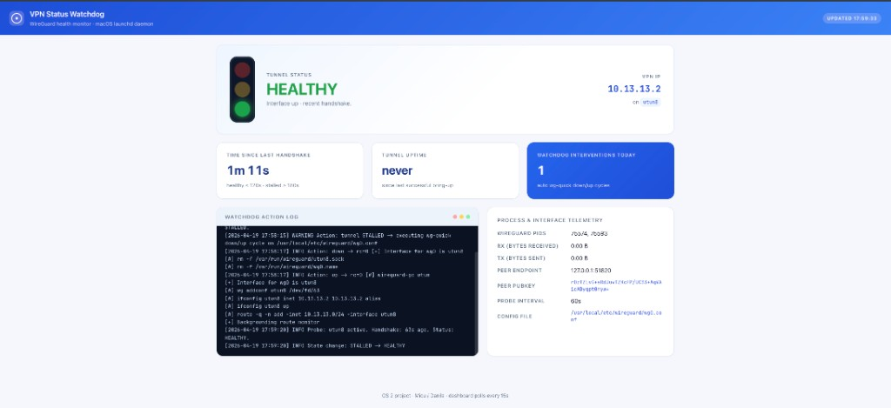

# VPN Status Watchdog

> Operating Systems 2 — Micu / Danila
> Self-healing macOS daemon that monitors a WireGuard tunnel and renders
> the live status on a clean blue Django dashboard.



A Python background service that:

1. Wakes up every 60 seconds (registered as a real macOS `launchd` daemon).
2. Probes the OS via `ifconfig`, `sudo wg show`, `netstat -ibn` and `ps`.
3. Decides whether the tunnel is **HEALTHY**, **STALLED**, **DEAD**,
   **UNAVAILABLE** (no `wg` userland on disk) or **UNKNOWN**
   (configured iface name doesn't point at a real WG tunnel).
4. Auto-restarts the tunnel with `wg-quick down/up` when it has to —
   protected by a per-status cooldown and a 5-recoveries-per-hour
   circuit breaker so a wedged tunnel can never DDoS the host.
5. Appends timestamped entries to `/var/log/vpn_watchdog.log` and writes
   a JSON snapshot the dashboard can read.
6. Goes back to sleep — and the dashboard polls the JSON every 15 s.

The repo also ships:

- One-button **`start_all.sh` / `stop_all.sh`** scripts that bring the
  whole stack up (or down + clean) in a single command.
- A self-contained **Docker test stack** so you can run the whole thing
  locally without a paid VPN account.
- A **Vercel demo** of the dashboard for sharing the UI publicly
  (deploys straight from GitHub, runs in read-only "demo mode").

---

## Table of contents

1. [Five-minute quickstart](#five-minute-quickstart)
2. [What the project actually contains](#what-the-project-actually-contains)
3. [Architecture](#architecture)
4. [The watchdog state machine](#the-watchdog-state-machine)
5. [Running each component](#running-each-component)
6. [Triggering every state on demand](#triggering-every-state-on-demand)
7. [Installing as a real macOS daemon](#installing-as-a-real-macos-daemon)
8. [Vercel demo deployment](#vercel-demo-deployment)
9. [Configuration reference](#configuration-reference)
10. [Logs & files](#logs--files)
11. [Troubleshooting](#troubleshooting)
12. [How it maps to the OS 2 syllabus](#how-it-maps-to-the-os-2-syllabus)

---

## Five-minute quickstart

The fastest path from a fresh clone to a working green dashboard with a
real WireGuard tunnel running on the same Mac (server in Docker, client
via `wg-quick`).

### Prerequisites (one-time)

```bash
brew install --cask docker            # Docker Desktop
brew install wireguard-tools          # provides wg + wg-quick
```

You also need Python 3.10+ (project tested on 3.14). Docker doesn't
need to be running — `start_all.sh` will launch it for you.

### 1. Clone and install Python deps

```bash
git clone https://github.com/bogdanmicu/vpn-tunnel-watchdog.git
cd vpn-tunnel-watchdog

python3 -m venv .venv
source .venv/bin/activate
pip install -r requirements.txt
```

### 2. Bring everything up with one command

```bash
./scripts/start_all.sh
```

This single script:

1. Auto-launches Docker Desktop if it's not already running.
2. Spins up the `linuxserver/wireguard` test container with strict
   resource caps (0.5 CPU, 256 MB RAM, 200 PIDs, log rotation).
3. Generates `wg0.conf`, strips the dangerous full-tunnel routes,
   adds `PersistentKeepalive=25` so the tunnel never goes idle,
   and brings it up via `wg-quick`.
4. Installs the watchdog as a real macOS `launchd` daemon and starts it.
5. Launches the Django dashboard in the background on
   `http://127.0.0.1:8000`.

It will ask for your sudo password once. The end of the output looks
like:

```
  Test stack : OK
  Daemon     : OK
  Dashboard  : http://127.0.0.1:8000
```

Open the URL in a browser. You should see a big green **HEALTHY** light,
your VPN IP (`10.13.13.2`), peer endpoint `127.0.0.1:51820`, and the
"time since last handshake" counter ticking up to ~25 s and resetting
on every keepalive.

### 3. Break things on purpose

```bash
./scripts/break_tunnel.sh dead            # interface disappears -> DEAD
./scripts/break_tunnel.sh stalled         # handshakes stop -> STALLED
./scripts/break_tunnel.sh unavailable     # wg-quick missing -> UNAVAILABLE
./scripts/break_tunnel.sh restore         # back to HEALTHY
```

Pair with `sudo tail -f /var/log/vpn_watchdog.log` to watch the daemon
react. See [Triggering every state on demand](#triggering-every-state-on-demand)
for the expected log lines and timing for each scenario.

### 4. Tear everything down

```bash
./scripts/stop_all.sh                     # stop + clean everything
./scripts/stop_all.sh --keep-logs         # same, but keep log files
```

`stop_all.sh` is **aggressive on purpose**. It:

1. Kills the dashboard process (PID file, `pkill`, AND port-based
   fallback — so an orphaned reloader child can't survive).
2. Removes the `launchd` plist and reaps any stuck `daemon.watchdog`.
3. Brings every WireGuard tunnel down (`wg-quick down` per iface).
4. Kills `wireguard-go` userspace daemons + clears `/var/run/wireguard/*`.
5. **Repairs the routing table** — explicitly deletes the orphaned
   `0.0.0.0/1`, `128.0.0.0/1` and `127.0.0.1` routes that a
   half-killed full-tunnel `wg-quick` can leave behind (this was a
   real bug; it broke loopback and made the dashboard unreachable).
6. Tears down the Docker test stack (`--purge`: removes container,
   volumes, image, keys).
7. Wipes logs (`--keep-logs` to opt out).

That's the whole loop. Everything below is reference material.

### Manual / piecewise alternative

If you want to run individual stages instead of the all-in-one
scripts, the underlying entry points still work:

```bash
./scripts/test_stack_up.sh                # just the docker WG server + tunnel
sudo ./scripts/install_daemon.sh          # just the launchd daemon
./scripts/run_dashboard.sh                # just the Django dashboard
sudo .venv/bin/python -m daemon.watchdog --once   # one probe, no looping
```

---

## What the project actually contains

```
.
├── api/                              # Vercel WSGI entry point (re-exports Django)
│   └── index.py
├── daemon/                           # The Python watchdog (no Django deps)
│   ├── __init__.py
│   ├── config.py                     # All tunables / paths
│   ├── probes.py                     # ifconfig + wg show + ps parsers
│   ├── state.py                      # HEALTHY / STALLED / DEAD / UNAVAILABLE
│   ├── recovery.py                   # wg-quick down / up cycle
│   ├── logger.py                     # File logger + JSON snapshot
│   └── watchdog.py                   # `python -m daemon.watchdog`
├── dashboard/                        # Django project
│   ├── manage.py
│   ├── dashboard/                    # settings + URLs + WSGI/ASGI
│   ├── monitor/                      # the single dashboard app
│   │   ├── services.py               # Reads daemon files, builds payload
│   │   ├── views.py                  # /, /api/state, /healthz
│   │   ├── urls.py
│   │   └── templates/monitor/index.html
│   └── static/monitor/{css,js}/
├── launchd/
│   └── com.micudanila.vpnwatchdog.plist
├── sample_data/                      # Used in DEMO mode (Vercel)
│   ├── state.json
│   └── vpn_watchdog.log
├── scripts/
│   ├── start_all.sh                  # one-button: stack + daemon + dashboard
│   ├── stop_all.sh                   # one-button: kill + clean (incl. routes)
│   ├── test_stack_up.sh              # docker WG server + wg-quick up
│   ├── test_stack_down.sh            # tear it back down
│   ├── break_tunnel.sh               # simulate STALLED/DEAD/UNAVAILABLE
│   ├── install_daemon.sh             # register as macOS LaunchDaemon
│   ├── uninstall_daemon.sh
│   ├── run_dashboard.sh              # local Django dev server
│   └── sudoers.example               # for running daemon as non-root in dev
├── requirements.txt
├── vercel.json
└── README.md
```

---

## Architecture

```
+--------------------------+        +----------------------------+
|     macOS launchd        |        |     Django dashboard       |
|  system/com.micudanila   |        |  http://127.0.0.1:8000     |
+-------------+------------+        +--------------+-------------+
              |                                    |
              | spawns / keeps alive               | reads
              v                                    v
+--------------------------+        +----------------------------+
|   daemon/watchdog.py     | -----> |  /var/log/vpn_watchdog.log |
|   (probe -> evaluate ->  | -----> |  /var/log/vpn_watchdog_    |
|    recover -> log loop)  |        |  state.json                |
+-------------+------------+        +----------------------------+
              |
              | subprocess
              v
+----------------------------------+
|  ifconfig | wg show | ps |       |
|  netstat -ibn (the OS probes)    |
+----------------------------------+
```

The daemon and the dashboard talk **only through files**. The dashboard
never runs `wg show`, never needs `sudo`. That's why the same Django app
can be deployed to Vercel: in demo mode it just reads bundled JSON +
log files from `sample_data/`.

---

## The watchdog state machine

Implemented in `daemon/state.py` and `daemon/watchdog.py`:

| Condition                                                                            | Status        | What the daemon does                                            |
|--------------------------------------------------------------------------------------|---------------|-----------------------------------------------------------------|
| `wg` binary not on disk at all                                                       | `UNAVAILABLE` | Log it, skip recovery, don't bump the counter.                  |
| `utunN` missing from `ifconfig`                                                      | `DEAD`        | `wg-quick up` immediately (DEAD bypasses the cooldown).         |
| No WG tunnels exist *anywhere* on the system (e.g. configured `utunN` is iCloud PR)  | `DEAD`        | Same as above.                                                  |
| `utunN` exists, other WG tunnels exist, but **this** iface isn't WG (wrong name)     | `UNKNOWN`     | Log it, **skip** recovery (would loop forever). User fixes name.|
| `utunN` is a real WG tunnel, handshake `<=` 120 s                                    | `HEALTHY`     | Sleep.                                                          |
| `utunN` is a real WG tunnel, handshake `>=` 180 s (or never seen)                    | `STALLED`     | `wg-quick down/up`, then 10-min cooldown before next attempt.   |
| `utunN` is a real WG tunnel, handshake between thresholds                            | `HEALTHY`     | Sleep (avoids flapping).                                        |

### Recovery rate-limiting

To stop the daemon from "self-DDoS"-ing the host when the tunnel is
permanently broken:

| Status      | Cooldown? | Hourly cap? | Why                                                                     |
|-------------|-----------|-------------|-------------------------------------------------------------------------|
| `STALLED`   | yes (10 min) | yes (5/hr) | Stale handshakes can self-heal once the peer comes back; no urgency.    |
| `DEAD`      | **no**       | yes (5/hr) | Missing iface = total outage; fix immediately, but cap to prevent thrashing. |
| `UNAVAILABLE` / `UNKNOWN` | n/a | n/a    | Recovery would either fail or loop forever — daemon refuses to try.     |

When the cap is hit you get one log line per cycle:
`Action: tunnel STALLED but recovery suppressed (circuit breaker open ...)` —
the daemon goes quiet until traffic on the iface (or `--once`) gives
the cap a chance to drain. Override with `RECOVERY_COOLDOWN_SEC` and
`MAX_RECOVERIES_PER_HOUR`.

Every state change (`HEALTHY -> DEAD -> HEALTHY`, …) is logged with a
dedicated `State change:` line so it's grep-friendly. The daily
intervention counter only increments when an actual `wg-quick` cycle
ran — not when we skipped because of cooldown, cap, or missing tools.

---

## Running each component

### The daemon (foreground, one shot)

```bash
sudo .venv/bin/python -m daemon.watchdog --once
```

Useful for cron jobs, testing parsers, and the `break_tunnel.sh` workflow.

### The daemon (foreground, looping)

```bash
sudo .venv/bin/python -m daemon.watchdog
# Ctrl-C cleanly exits via SIGINT.
```

### The daemon (background, official macOS daemon)

See [Installing as a real macOS daemon](#installing-as-a-real-macos-daemon)
below.

### The dashboard

```bash
./scripts/run_dashboard.sh                # http://127.0.0.1:8000
./scripts/run_dashboard.sh 0.0.0.0:9000   # bind on all interfaces
```

The dashboard re-fetches `/api/state` every 15 s and ticks the
"time since last handshake" counter every 1 s on the client between
polls.

If two consecutive polls fail (e.g. you ran `stop_all.sh` while a tab
was still open), the page **visibly** flips to a disconnected state:
diagonal grey stripes overlay the hero, the badge prefixes with
`DISCONNECTED ·` in red, and the local handshake tick freezes so
nothing on screen pretends to be live. As soon as the API answers
again, the next poll clears all of that automatically.

> Tip: set `VPN_WATCHDOG_LIVE_PROBE=1` if you want the dashboard itself
> to re-probe the OS on every API call. Handy when you don't have the
> daemon installed.

---

## Triggering every state on demand

Once the test stack is up (`./scripts/test_stack_up.sh`) and the daemon
is running (either `--once` after each step, or installed via launchd),
run any of these:

| Command                                  | What happens                                                                                       | Expected log lines                                                              |
|------------------------------------------|----------------------------------------------------------------------------------------------------|---------------------------------------------------------------------------------|
| `./scripts/break_tunnel.sh stalled`      | Stops the WG server container. The Mac's `utun*` stays up but no new handshakes arrive.            | `Status: STALLED` after ~3 min, then `Action: wg-quick down/up`, then `HEALTHY` |
| `./scripts/break_tunnel.sh dead`         | Runs `wg-quick down`. The interface disappears from `ifconfig`.                                    | `Status: DEAD`, then `Action: wg-quick up`, then `HEALTHY`                      |
| `./scripts/break_tunnel.sh unavailable`  | Moves `wg-quick` to `wg-quick.bak` so the daemon thinks the tools are missing.                     | `Status: UNAVAILABLE` and a single `ERROR Action: skipped` line                 |
| `./scripts/break_tunnel.sh restore`      | Puts `wg-quick` back, restarts the container, brings the tunnel back up.                           | `State change: ... -> HEALTHY`                                                  |

To make a STALLED test fire in seconds instead of minutes, lower the
thresholds for that run only:

```bash
export VPN_WATCHDOG_INTERVAL=10
export VPN_WATCHDOG_HEALTHY=15
export VPN_WATCHDOG_STALLED=20
sudo -E .venv/bin/python -m daemon.watchdog          # -E keeps env vars
```

---

## Installing as a real macOS daemon

This is the "OS 2 flex" — register the watchdog as an *official* macOS
background daemon (not just `python script.py &`):

```bash
sudo ./scripts/install_daemon.sh
```

The script:

1. Reads `launchd/com.micudanila.vpnwatchdog.plist`.
2. Substitutes `__PROJECT_DIR__` and `__PYTHON_BIN__` with absolute
   paths from your checkout (preferring `.venv/bin/python3`).
3. Writes the rendered manifest to
   `/Library/LaunchDaemons/com.micudanila.vpnwatchdog.plist`.
4. `bootstrap` + `enable` + `kickstart` it through `launchctl`.

The plist is deliberately conservative:

- `RunAtLoad=false` — does not auto-start at boot.
- `KeepAlive=false` — if the daemon exits or is killed, **launchd
  leaves it dead**. You start it back up explicitly.
- `ThrottleInterval=300` — floor on time between manual restarts.

That combination is the fix for an earlier incident where the daemon
was respawning every few seconds and saturating the host. To start it
back up after a `kill` or `stop_all`, run `sudo launchctl kickstart
system/com.micudanila.vpnwatchdog` (or just `./scripts/start_all.sh`).

Verify:

```bash
sudo launchctl print system/com.micudanila.vpnwatchdog | head
sudo tail -f /var/log/vpn_watchdog.log
```

Uninstall any time:

```bash
sudo ./scripts/uninstall_daemon.sh
```

The daemon runs as `root` (default for LaunchDaemons), so the embedded
`sudo -n wg show` / `sudo -n wg-quick` calls succeed without a password
prompt. If you want to run the daemon as your normal user during
development, copy the snippet from `scripts/sudoers.example` into
`/etc/sudoers.d/vpn_watchdog`.

---

## Vercel demo deployment

> **What can and can't go on Vercel.** The watchdog daemon needs root,
> a `wg-quick` binary, the macOS `launchd` system, and the actual
> WireGuard tunnel running on your machine — none of which exist
> inside a serverless function. So the daemon is **always local**.
> What we *can* publish to Vercel is the Django dashboard, in
> read-only **demo mode**, serving the bundled `sample_data/`. That's
> what `vercel.json` + `api/index.py` set up.

### Files involved

| File                           | Role                                                                  |
|--------------------------------|-----------------------------------------------------------------------|
| `vercel.json`                  | Routes every URL to one Python serverless function + sets env vars.   |
| `api/index.py`                 | Vercel entry point; re-exports the Django WSGI app.                   |
| `sample_data/state.json`       | Pretend daemon snapshot (HEALTHY example).                            |
| `sample_data/vpn_watchdog.log` | Pretend log file shown in the action-log terminal.                    |

`vercel.json` already pins the env:

```json
"env": {
  "VPN_WATCHDOG_DEMO": "1",
  "DJANGO_DEBUG": "0",
  "DJANGO_ALLOWED_HOSTS": ".vercel.app,.now.sh,localhost,127.0.0.1"
}
```

`VPN_WATCHDOG_DEMO=1` makes `monitor/services.py` read the JSON+log
out of `sample_data/` instead of trying to call `wg show`.

### Option A — Deploy from GitHub (recommended)

The "set it once, push to deploy" path. Every push to `main` becomes a
production deployment; every PR gets its own preview URL.

1. **Push the project to GitHub** (it already lives at
   `bogdanmicu/vpn-tunnel-watchdog` per the quickstart). Make sure
   `vercel.json`, `api/index.py`, `sample_data/` and `requirements.txt`
   are all committed.
2. Sign in at [vercel.com](https://vercel.com) with the GitHub account
   that owns the repo. Click **Add New… → Project**.
3. Pick `vpn-tunnel-watchdog` from the import list. Vercel will detect
   `vercel.json` and the `@vercel/python` runtime.
4. **Framework preset**: leave as "Other". **Root directory**: leave
   blank (the repo root). **Build command** / **Output directory**:
   leave blank — `vercel.json` does the wiring. **Install command**:
   `pip install -r requirements.txt` (Vercel infers this, but set it
   explicitly if asked).
5. Under **Environment Variables**, the three from `vercel.json` will
   already be populated. You can leave them. If you want to override
   anything (e.g. add a real `DJANGO_SECRET_KEY` instead of the demo
   default in `dashboard/settings.py`), add it here.
6. Click **Deploy**. After ~60 s you get a `*.vercel.app` URL serving
   the dashboard with the sample data.
7. Future pushes to `main` redeploy automatically. PRs get preview
   URLs you can share before merging.

### Option B — Deploy from the CLI

Useful for one-off pushes from your laptop, no GitHub integration
required:

```bash
npm i -g vercel        # one time
vercel login           # follow the OAuth flow
vercel                 # first deploy → preview URL
vercel --prod          # promote to production
```

### What you'll see

- Big **HEALTHY** light, sample VPN IP, fake handshake counter, and
  one or two log lines from `sample_data/vpn_watchdog.log`.
- The "interventions today" box, peer pubkey, RX/TX, and config path
  are all populated from `sample_data/state.json`.
- The disconnect detector still works on Vercel — if the function
  cold-starts and the first `/api/state` request times out, the page
  briefly shows `DISCONNECTED · ` before the next poll succeeds.

### "But I want the live data on Vercel"

The dashboard can't reach your Mac directly (NAT, dynamic IP, no
inbound port). The clean upgrade is:

1. Have the daemon `POST` its `state.json` to a tiny KV after every
   probe (Vercel KV, Upstash Redis, a public GitHub Gist, an S3 bucket
   — any of those is one HTTP call from `daemon/logger.py`).
2. Replace the `read_state_path()` call in `monitor/services.py` with
   a `requests.get(...)` against that KV.

That's a ~30-line change and lets the deployed dashboard mirror your
real tunnel in near real time.

### Common Vercel gotchas

- **`collectstatic` errors** — the project uses
  `WHITENOISE_USE_FINDERS=True`, so `collectstatic` is intentionally
  not required. If you fork and switch on manifest static-files
  storage, add `python dashboard/manage.py collectstatic --noinput`
  to a `vercel-build` step in `package.json`.
- **`DisallowedHost` 400 errors** — your custom domain isn't in
  `DJANGO_ALLOWED_HOSTS`. Add it in the Vercel project settings under
  Environment Variables, then redeploy.
- **Function size limit** — `requirements.txt` is small enough that
  this hasn't been an issue. If you add heavy deps (e.g. `numpy`),
  Vercel may reject the bundle; move that code to a separate function
  or pin a slimmer alternative.
- **Cold starts show DISCONNECTED briefly** — that's the disconnect
  detector doing its job during the function's cold boot. It clears
  on the next poll.

---

## Configuration reference

Every tunable is an environment variable read by `daemon/config.py`.
Set them in the launchd plist (`EnvironmentVariables` block), in your
shell, or in `vercel.json`.

| Variable                       | Default                                 | Meaning                                                          |
|--------------------------------|-----------------------------------------|------------------------------------------------------------------|
| `VPN_WATCHDOG_IFACE`           | `utun3`                                 | macOS WireGuard interface (auto-detected if this one isn't WG)   |
| `VPN_WATCHDOG_CONF`            | `/usr/local/etc/wireguard/wg0.conf`     | Absolute path to your `wg0.conf`                                 |
| `VPN_WATCHDOG_INTERVAL`        | `60`                                    | Seconds between probes                                           |
| `VPN_WATCHDOG_HEALTHY`         | `120`                                   | Handshake age `<=` this → HEALTHY                                |
| `VPN_WATCHDOG_STALLED`         | `180`                                   | Handshake age `>=` this → STALLED                                |
| `VPN_WATCHDOG_RESTART_PAUSE`   | `2`                                     | Seconds between `wg-quick down` and `up`                         |
| `RECOVERY_COOLDOWN_SEC`        | `600`                                   | Min seconds between two STALLED recoveries (DEAD bypasses this)  |
| `MAX_RECOVERIES_PER_HOUR`      | `5`                                     | Hard cap on `wg-quick` cycles per hour (circuit breaker)         |
| `VPN_WATCHDOG_LOG`             | `/var/log/vpn_watchdog.log`             | Human-readable log file                                          |
| `VPN_WATCHDOG_STATE`           | `/var/log/vpn_watchdog_state.json`      | JSON snapshot read by the dashboard                              |
| `VPN_WATCHDOG_COUNTER`         | `/var/log/vpn_watchdog_counter.json`    | Daily intervention counter                                       |
| `VPN_WATCHDOG_WG`              | `/opt/homebrew/bin/wg`                  | `wg` binary path                                                 |
| `VPN_WATCHDOG_WGQUICK`         | `/opt/homebrew/bin/wg-quick`            | `wg-quick` binary path                                           |
| `VPN_WATCHDOG_DEMO`            | `0`                                     | `1` → dashboard reads `sample_data/` (used on Vercel)            |
| `VPN_WATCHDOG_LIVE_PROBE`      | `0`                                     | `1` → dashboard re-probes the OS on every API call               |
| `POLL_MS` (window-scoped JS)   | `15000`                                 | Dashboard front-end poll interval. Set `window.POLL_MS` in HTML. |
| `WG_TEST_CONTAINER`            | `wg-test`                               | Docker container name used by the test scripts                   |
| `WG_TEST_HOST_DIR`             | `~/wg-test`                             | Where the test container stores its keys                         |
| `WG_TEST_PORT`                 | `51820`                                 | UDP port the test server listens on                              |
| `WG_TEST_CPUS`                 | `0.5`                                   | CPU cap for the test container                                   |
| `WG_TEST_MEMORY`               | `256m`                                  | Memory cap                                                       |
| `WG_TEST_PIDS`                 | `200`                                   | Max processes inside the container                               |
| `WG_TEST_LOG_SIZE`             | `10m`                                   | Docker log file size before rotation                             |
| `WG_TEST_LOG_FILES`            | `3`                                     | Number of rotated docker log files to keep                       |
| `WG_TEST_RESTART`              | `no`                                    | Docker `--restart` policy (set `on-failure:3` to auto-recover)   |
| `DASHBOARD_PORT`               | `8000`                                  | Port `stop_all.sh` checks for an orphaned dashboard listener     |
| `DJANGO_DEBUG`                 | `1`                                     | Set to `0` in production / Vercel                                |
| `DJANGO_ALLOWED_HOSTS`         | `127.0.0.1,localhost,.vercel.app,…`     | Standard Django setting                                          |

All log/state files automatically fall back to
`~/.vpn_watchdog/<name>` and finally to `<repo>/local_logs/<name>` if
the configured location isn't writable, so the daemon never crashes on
permission errors during development.

---

## Logs & files

| Path                                          | Owner    | Purpose                                              |
|-----------------------------------------------|----------|------------------------------------------------------|
| `/var/log/vpn_watchdog.log`                   | root     | Rotating human-readable log (2 MiB × 3 backups)      |
| `/var/log/vpn_watchdog.stdout.log`            | root     | launchd stdout capture                               |
| `/var/log/vpn_watchdog.stderr.log`            | root     | launchd stderr capture                               |
| `/var/log/vpn_watchdog_state.json`            | root     | Atomic JSON snapshot consumed by the dashboard       |
| `/var/log/vpn_watchdog_counter.json`          | root     | `{ "YYYY-MM-DD": N }` daily intervention counter     |
| `~/.vpn_watchdog/*`                           | user     | Dev fallback when `/var/log` isn't writable          |
| `local_logs/*`                                | user     | Last-resort fallback inside the repo                 |

Sample log entries:

```
[2026-04-19 10:00:02] INFO Probe: utun6 active. Handshake: 213s ago. Status: STALLED.
[2026-04-19 10:00:02] WARNING Action: tunnel STALLED -> executing wg-quick down/up cycle on /usr/local/etc/wireguard/wg0.conf
[2026-04-19 10:00:03] INFO Action: down -> rc=0 ok
[2026-04-19 10:00:05] INFO Action: up -> rc=0 ok
[2026-04-19 10:00:05] INFO State change: STALLED -> HEALTHY
```

---

## Troubleshooting

**`Docker isn't running. Start Docker Desktop first.`**
Open Docker Desktop and wait for the whale icon in the menu bar to
stop animating, then re-run `./scripts/test_stack_up.sh`.

**`wg show` exits with `Operation not permitted`.**
You're running the daemon as a normal user without sudoers permission.
Either install it via `sudo ./scripts/install_daemon.sh` (it then runs
as root) or copy `scripts/sudoers.example` into
`/etc/sudoers.d/vpn_watchdog`.

**`sudo: a password is required`.**
Same cause as the previous one. Use `sudo` explicitly, or install via
launchd, or set up sudoers.

**Dashboard says `UNKNOWN` forever.**
The state JSON file doesn't exist yet. Run one probe by hand
(`sudo .venv/bin/python -m daemon.watchdog --once`), or set
`VPN_WATCHDOG_LIVE_PROBE=1` when launching the dashboard so it probes
the OS itself on every request.

**Dashboard says `DEAD` even though the tunnel "looks" up.**
You probably brought the tunnel up through a GUI app (ProtonVPN /
Tailscale / macOS native WireGuard). Those apps use Apple's
NetworkExtension framework, so the interface won't appear in
`sudo wg show interfaces` — and the watchdog (rightly) refuses to
treat unknown utuns as ours. Use the test stack or any `wg-quick`-
managed config instead.

**Test stack stuck at `Waiting for the container to generate ...`.**
Run `docker logs wg-test` to see what's wrong (image still pulling,
port already in use, etc.).

**`launchctl bootstrap` fails with `Bootstrap failed: 5: Input/output error`.**
Another copy of the daemon is already loaded. Run
`sudo launchctl bootout system/com.micudanila.vpnwatchdog` first, then
re-run `install_daemon.sh`.

**Wrong interface name.**
WireGuard picks the next free `utunN` slot on each startup. The daemon
auto-detects the right one via `wg show interfaces` regardless of
`VPN_WATCHDOG_IFACE`, so this should "just work" — but if you want the
dashboard's "configured iface" line to match reality, re-export
`VPN_WATCHDOG_IFACE=utunN` and re-kickstart.

**`wg-quick up` fails with `Address already in use`.**
A prior `wireguard-go` process is still holding the utun. The test
script auto-recovers via `pkill -9 wireguard-go` and one retry, but
you can do it by hand:
```bash
sudo pkill -9 wireguard-go
sudo rm -f /var/run/wireguard/*.sock /var/run/wireguard/*.name
./scripts/test_stack_up.sh
```

**Internet is broken / `curl 127.0.0.1` says "Can't assign requested address".**
A previous full-tunnel `wg-quick up` ran with `AllowedIPs=0.0.0.0/0`
and the `0.0.0.0/1`, `128.0.0.0/1`, `127.0.0.1` route hijacks didn't
get cleaned up. `stop_all.sh` deletes them on every run. Manual fix:
```bash
sudo route -n delete -inet 0.0.0.0/1   2>/dev/null
sudo route -n delete -inet 128.0.0.0/1 2>/dev/null
sudo route -n delete -inet 127.0.0.1   2>/dev/null
```

**Tunnel is up, `ping 10.13.13.1` works, but the dashboard says STALLED.**
You're missing `PersistentKeepalive`. Without it, split-tunnel WG only
handshakes when traffic flows, so the handshake ages past 180s with
nothing to refresh it. `test_stack_up.sh` adds
`PersistentKeepalive = 25` automatically; verify with
`sudo grep PersistentKeepalive /usr/local/etc/wireguard/wg0.conf`.

**Dashboard "interventions today" stays at 0 even after `break_tunnel.sh dead`.**
Probably the recovery cooldown is suppressing it (you triggered a
STALLED recovery in the last 10 minutes). Check the log for
`recovery suppressed (cooldown active, ...)`. With the latest code,
DEAD bypasses the cooldown — kickstart the daemon to pick up the new
behaviour: `sudo launchctl kickstart -k system/com.micudanila.vpnwatchdog`.

**Dashboard timer keeps ticking after I ran `stop_all.sh`.**
The old behaviour. The latest dashboard JS detects two consecutive
poll failures and grays out with `DISCONNECTED · `. If you don't see
that, hard-refresh (Cmd+Shift+R) — the browser is serving cached JS.

**Dashboard survives `stop_all.sh`.**
An orphaned reloader child can survive `kill PID`. The latest
`stop_all.sh` has a port-based fallback (`lsof -ti tcp:8000 | xargs
kill`) so this shouldn't happen. If it still does, the script's final
sanity check will say "Something is still bound to :8000" and point
you at the diagnosis command.

**Vercel build complains about `collectstatic`.**
The repo uses `WHITENOISE_USE_FINDERS = True`, so `collectstatic` is
intentionally not required. If your fork enables manifest storage, add
`python dashboard/manage.py collectstatic --noinput` to a `vercel-build`
step in `package.json`.

---

## How it maps to the OS 2 syllabus

| OS 2 topic                          | Where it shows up in the project                                           |
|-------------------------------------|----------------------------------------------------------------------------|
| Background processes / daemons      | `launchd/com.micudanila.vpnwatchdog.plist` + `scripts/install_daemon.sh`    |
| `subprocess` / IPC with the kernel  | `daemon/probes.py`, `daemon/recovery.py`                                   |
| Process inspection                  | `probe_processes()` reading `ps -Ao pid,comm,args`                         |
| Network interface introspection     | `probe_interface()` parsing `ifconfig` + `netstat -ibn`                    |
| Signals / clean shutdown            | `_handle_signal()` in `daemon/watchdog.py`                                 |
| File-based IPC between programs     | `state.json` written by daemon, read by Django dashboard                   |
| Containers / process isolation      | `scripts/test_stack_up.sh` runs the WG server in a Docker container        |
| Log rotation                        | `RotatingFileHandler` in `daemon/logger.py`                                |
| Atomic file writes                  | `write_state()` writes `*.tmp` + `replace()`                               |

That's the whole thing. Have fun breaking it.
